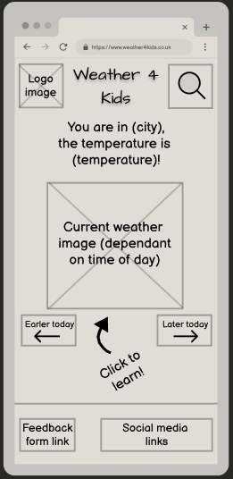
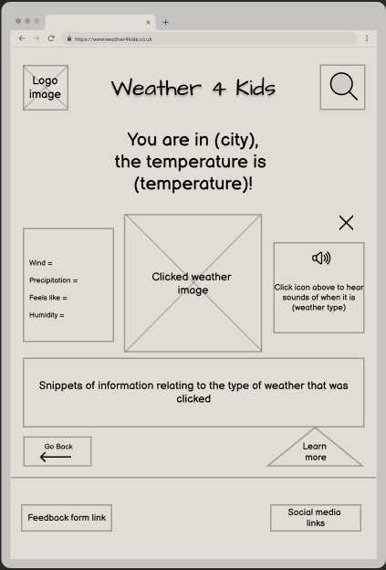

# Weather 4 Kids
The purpose of this project is to create a website that assists young children with learning about the weather. The site will be intended to be interactive, fun, engaging and provide information in a way that is easier for younger children to understand.

[View the live project here](https://dalefielding.github.io/weather4kids/)

## User Experience (UX)

### User Stories 
1. As a user, I would like to view the current weather forecast for today in my location.
2. As a user, I would like to view the details of the current weather. Such as precipitation, wind etc.
3. As a user, I would like to see imagery relating to the type of weather.
4. As a user, I would like to hear sounds appropriate to the type of weather.
5. As a user, I would like to interact with elements in the site.
6. As a user, I would like to learn about weather through snippets of information.
7. As a user, I would like to provide feedback to the site owner/developer, and for this to be acknowledged.

### Site Objectives
1. To assist young children (ages 4-7) with learning about the weather.
2. To be responsive and functional.
3. To meet all accessibility requirements, allowing anyone to use the site regardless of their abilities/needs.
4. To display reasonably accurate data relating to the weather.

## Design
### Strategy
  Taking into account the intended website, I have:
  - Spoken with a primary school teacher to obtain their opinion on requirements for this age group. They have suggested that children of this age will respond well to; bright/vibrant visuals and interactive elements. Also Information should be concise and the site easy to use.<br>

  - Conducted research into similar sites:
    - [Weather wiz kids](https://www.weatherwizkids.com/) 
    - [Kids weather report](https://kidsweatherreport.com/report/bristol/c) 
    - [Climate kids - weather and climate ](https://climatekids.nasa.gov/) 
    - [DK findout - weather](https://www.dkfindout.com/uk/earth/weather/)<br>
   
    General findings from site research:
    - A couple of the sites display the actual weather through an API. One only provides for a fixed location (Indianapolis), the other shows this for the current location and also has an option to search other locations.
    - Colouring varies between sites. Most have opted for a white background with one or two colours. One site has multiple colours and a blue background.
    - They all contain imagery, some more than others.
    - Kid style fonts are generally used for headings.
    - They all display a logo at the top of the page. 
    - Navigation is towards the top of the page.
    - Footers generally have navigation.
 
  In summary, I believe there is an opportunity to make this website really stand out from the others in terms of the target market.<br>It seems that the majority of other sites tend to be very informative but not overly eye-catching or engaging. I also feel that younger children may be overwhelmed with the vast amount of information displayed. <br>
    
  The strategy is to create a website that meets all of the expectations from the user stories, site objectives and takes into account findings from the research conducted. 

### Scope
  I have listed the possible features below and ranked 1-5 in level of importance/relevance to user needs (1 being most important and viable/feasible):
  | Possible Feature | Rank |
  |---|---|
  | Current weather displayed for today from current location | 1 |
  | Weather icons/images | 1 |
  | Snippets of information | 1 |
  | 404 page | 1 |
  | Site navigation | 1 |
  | Accessibility | 1 |
  | Device/resolution responsivity | 1 |
  | Responses to user action | 1 |
  | Interactive elements | 1 |
  | Contact us/feedback form | 1 |
  | Ability to search for other locations | 1 |
  | Current weather broken down into;<br> &nbsp; morning, afternoon, evening and night | 2 |
  | Audio - weather sounds  | 2 |
  | Logo | 3 |
  | Social links | 3 |
  | Video footage | 4 |
  | Animations | 4 |
  | Quiz | 5 |
  | Weather tips | 5 |

  Following review of scope, I had decided not to include:
  - Video footage 
  - Animations 
  - Quiz
  - Weather tips

  This decision was made as these would extend beyond the necessary requirements for the project and may take more time than appropriate. They will be considered for future implementations.

### Structure 

The site will be designed largely as a single page layout, with the majority of the features within the homepage. The only exception to this will likely be the 404 page.<br> I have listed the pages below including the features they will contain. Not all features will be displayed on initial page load, instead the main content will be replaced when necessary to dynamically change the layout/content using JavaScript and/or covered by a model.

* Homepage:
  * Logo and site name, clicking on these will reload the home page.
  * Location search bar.
  * A heading that lets the user know the city they are in, current temperature and feels like temperature.
  * Current weather information will be displayed for current location; morning, afternoon, evening and night. These will be clickable, and will dynamically change the html in the page with:
    - Snippets of information for learning about the current weather, the user will be able to discover further information by clicking a button.
    - A button to play audio that is relevant to the current weather/snippet.
    - Details relating to current weather such as; precipitation, wind etc.
  * Social media links.
  * Contact/feedback form, when clicked the main content will be replaced with:
    * A form that allows the user to enter their name, email and any feedback or questions. To then press submit and be notified if successful.
  * Interactive elements will be made obvious and easy to use, and when html has dynamically changed to other content there will be a button to indicate how to get back to the home page.
  * Semantic HTML will be used throughout.

* 404 page:
  * Will be consistent in that it shares the same design as the home page, including the logo and the footer, however it will not include the general content from the home page. 
  * A message to the user that they have tried to visit a page in the domain that does not exist.
  * There will be an obvious link/button within the page content that will direct the user to the home page.

### Skeleton
#### Wireframes

##### Mobile View:
  <details><summary>Homepage</summary>
    
  </details>
  <details><summary>Homepage - after weather image has been clicked</summary>
    
  </details>
  <details><summary>Homepage - after search bar has been selected and typed into</summary>
    
  </details>
  <details><summary>Homepage - after feedback link has been clicked</summary>
    
  </details>
  <details><summary>404 page</summary>
    
  </details>

##### Tablet View:
  <details><summary>Homepage</summary>
    
  </details>
  <details><summary>Homepage - after weather image has been clicked</summary>
    
  </details>
  <details><summary>Homepage - after search bar has been selected and typed into</summary>
    
  </details>
  <details><summary>Homepage - after feedback link has been clicked</summary>
    
  </details>
  <details><summary>404 page</summary>
    
  </details>

##### Desktop view:
  <details><summary>Homepage</summary>
    
  </details>
  <details><summary>Homepage - after weather image has been clicked</summary>
    
  </details>
  <details><summary>Homepage - after search bar has been typed into</summary>
    
  </details>
  <details><summary>Homepage - after feedback link has been clicked</summary>
    
  </details>
  <details><summary>404 page</summary>
    
  </details>
<br>

>Note; the decision was made to slightly alter the design during developement. Some of the wording has been altered, and it was decided to not include a triangular shaped button.

### Surface
#### Habits and conventions:
Users will navigate through the site by scrolling down the pages, through clicking on the various buttons and interactive elements within the site.

#### Typography
I have chosen a combination of Sniglet and Cabin for the website, as I feel these suit the target audience, complement each other nicely, are clear and readable.

#### Colour Scheme:

* I have chosen to go for what I would consider a colourblind safe palette.
* I had initially gone for a lighter blue as the main colour for the site as I felt this was very vibrant and engaging. However following validation this didn’t meet the contrast standards so the main blue was made darker to meet these standards.
* The chosen colour scheme meets the Web Content Accessibility Guidelines for readability.


## Features 
### General
* Responsive on all device sizes.
* Meta descriptions included to improve SEO.
* Semantic elements, alt attributes and sr attributes to assist with accessibility/screen readers.
* Connected to a weather api (WeatherAPI.com) where data is fetched and displayed dynamically across the webpage.

### Site Header
* Includes the Logo, which directs to the home page when clicked.
* Site name is displayed as the main heading.
* Search icon and search bar is displayed next to the search icon, this is hidden is screen width is less than 768px.<br>
Note, as the search function is currently not functional, a tooltip and a placeholder has been added to let users know that the search location function is coming soon.

### Site Main Content
* Introductory message. This changes dynamically depending on whether location access has been allowed or if it hasn’t been allowed. It includes the user's location or a default location, it also displays the current temperature for that location.

* Weather cards. Three weather cards are displayed next to each other inline on the page with the middle one enlarged. 
  * These display the current periods of the day.
  * Show images that are appropriate to the weather for that period of the day; before morning, morning, afternoon, evening and night. <br>
  Note, there is currently the potential that is will display a sunny icon when it is either before morning or night. The intention is to change this in the future.

* Earlier today and later today buttons. These are directional buttons and include icons (arrows) that indicate which direction. <br>
When clicked, the position of the weather cards is altered from left to right as a kind of slider effect. <br>
The before morning and night cards are not on display initially but will appear on display when appropriate.

* Arrow and 'click to learn' message directs the user to click on the weather cards. When the weather cards are clicked this will change the main content on the page to what I call '**second view**'.

* Second view. 
  * Includes the clicked weather card.
  * Contains a box that displays a sound icon and a message to click sound icon. When clicked a sound will play that is appropriate to that type of weather.<br>
  Note, this currently has only three sounds currently available; birds chirping, thunder sound, and rain. The intention is to develop this further in the future. 
  * Contains a box that displays snippets of information, this will be tailored to the specific weather type initially.
  * The Learn more button when clicked with randomly select a new snippet of information in the snippet box.
  * There are two ways to exit out of ‘second view’, by clicking the go back button or by clicking the cross icon.

### Site Footer
* Contact / feedback button within. When clicked, this replaces the main content on the page with a form.
  * This form has various sections to complete which are all required and there is some functionality that ensures invalid data is being handled intelligently.
  * A submit button that when clicked will display any validation errors for the user to be aware of. If no validation errors a message will be displayed to thank the user for contacting us, this includes a smiley emoji.
  * There are two ways to exit out of the form view, by clicking the go back button or by clicking the cross icon.
* Credit to the weatherapi, which includes link to their external page
* Icons for social media; facebook, twitter and instagram. These include links to their external pages.

### 404 page
* Contains the same heading and footer as the main page.
* An introductory message that lets the user know that they are trying to reach a page that doesn't exist.
Includes a large logo in the centre of the page, but with a sad fact instead if a smiley face.
There is a button that allows them to go to the home page when clicked.

## Future implementations:
* Full functionality to be incorporated into the search bar/icon. Resulting in the ability to search for other cities around the world.
  * While typing this will display suggestions in a drop down list that will appear below the search bar/icon. 
  * When a city is selected the weather api will pull the data appropriate to that location and display the relevant data within the webpage.
* Wider range of weather icons will be available for the cards so that it can display a more accurate picture to the type of weather. Some examples of this would be; heavy rain, light rain, sleet, windy, night time weather icons etc.
* Smoother transition when moving weather cards directionally, including the ability to swipe when using a touch screen.
* Further sounds to be incorporated that are appropriate to the type of weather.
* Further snippets of information to be added to provide a much bigger variety.
* Other Weather APIs to be considered due to occasional inconsistencies with accuracy.
* Safari browser functionality to work as intended. Currently not all elements are working as intended.

## Deployment
Deployed using GitHub Pages by following these steps:
1. In the GitHub repository navigate to the Settings tab.
2. On the left-hand menu select Pages.
3. For the source select Branch: master.
4. After the webpage refreshes automatically you will ses a ribbon on the top saying your site has been published.

Forking the repository is possible by following these steps:
1. Go to the GitHub repository.
2. Click on Fork button in the upper right hand corner.

Cloning the repository is possible by following these steps:
1. Go to the GitHub repository. 
2. Locate the Code button above the list of files and select. 
3. Select if you prefer to clone using HTTPS, SSH, or Github CLI and click the copy button to copy the URL to your clipboard.
4. Open Git Bash.
5. Change the current working directory to the one where you want the cloned directory.
6. Type git clone and paste the URL from the clipboard ```$ git clone https://github.com/YOUR-USERNAME/YOUR-REPOSITORY```
7.Press Enter to create your local clone.

## Technologies Used

### Languages Used

-   [HTML5](https://en.wikipedia.org/wiki/HTML5)
-   [CSS3](https://en.wikipedia.org/wiki/Cascading_Style_Sheets)
-   [JavaScript](https://en.wikipedia.org/wiki/JavaScript)
-   [JQuery](https://en.wikipedia.org/wiki/JQuery)

### Frameworks, Libraries & Programs Used

* [Bootstrap 5.3.2:](https://getbootstrap.com/docs/5.3/getting-started/introduction/)
    - Bootstrap was used to assist with the responsiveness of all pages.
* [Font Awesome:](https://fontawesome.com/)
    - Font Awesome was used on the social media links in the footer, the smiley emoji in the form and the magnifying glass in the header.
* [Google Fonts:](https://fonts.google.com/)
    - Google fonts were used to import the chosen fonts that were used throughout the webpages.    
* [Git](https://git-scm.com/)
    - Git was used for version control to commit to Git and Push to GitHub.
* [GitHub:](https://github.com/)
    - GitHub is used to store the project’s code after being pushed from Git.
* [Visual Studio Code](https://code.visualstudio.com/)
    - Visual Studio Code was used as the IDE for the project.
* [Figma](https://www.figma.com/login?is_not_gen_0=true) 
    - Figma was used to complete further wireframes for mobile, tablet and desktop pages.
* [Photoshop:](https://www.adobe.com/ie/products/photoshop.html)
    - Photoshop was used to adjust image sizes, improve resolution, and combine images.
* [Shutterstock](https://www.shutterstock.com/)
    - Shutterstock Was used to obtain the images for the weather cars
* [Free Logo Design](https://www.freelogodesign.org/) 
    * Free Logo Design was used to create the logo.
* [TinyPng](https://tinypng.com/) 
    * Was use to reduce the pdf size of the images.

## Code

### Templates 
*  [Bootstrap Library](https://getbootstrap.com/docs/5.3/getting-started/introduction/ "link to Bootstrap Docs"):
    * Has been used through the project to assist with making the pages responsive. 
    * I have used some template code from Bootstrap documentation, such as the form.
    * I have made amendments to these in order to suit the chosen design for the website.

