# Testing

I have considered the testing approaches for this project; automated versus manual.

I believe automated testing works well when tests would take a very long time to do manually, or if tests need to be repeated over and over again. 
I believe that manual testing can be better when you only need to run a test a couple of times.

For this project, I have used manual testing throughout development and post development so that I can take a hands-on approach and ensure everything works smoothly.

## Validation 
### WSC - Markup Validation Service

* I have entered all of my pages into the validator. 
* Only one error had appeared which was due to using back slashes in the href for my the site log, corrected by amended to forward slashes.
Now no errors appear.
* A warning appeared due to section elements not containing headers, as headers are not needed the validator suggested I replace these sections with divs. I have done so.

### W3C - CSS Validation Service
* I have entered my external css file into the validator.
* Only one error appeared which was due to incorrectly using rgba for css box-shadow. I have now replaced this with opacity instead, this has fixed the error.
* A warning appeared regarding the use of text-stroke as this is a webkit style. After doing some research I was able to determine that a similar look can be achieved by using text-shadow instead, this has been amended and doesnt flag as a warning.
* Warnings appear in relation to using variables for the colours/fonts. I have left these in as css variables were taught in one of the codeinstitute lessons.

### Wave - Web Accessible Evaluation Tool
#### Index.html:
* One error due to a label element for the search bar not containing text, I have removed the label element as it isn’t needed.
* Eighteen contrast errors appeared, I have fixed these by making the main blue darker.
  * The h1 still shows up as a contrast error but this is only because it doesn't pick up the text-shadow outline of the text; the colour of the outline does meet the contrast guidelines as it is used frequently throughout the site. 
* Two alerts due to the same alt text being used on elements. This is as they should be since there is more than one weather card on the page, the weather type is determined dynamically. 
* One alert due to a heading level being skipped (from h2 to h4). This is referring to the click to learn message as I did have this as a h4, however realising that it isn’t a header I have changed it to a paragraph and modified the text size.
* One alert due to the click to learn message appearing as a heading, however this is not a heading so I have not made any changes with this.

##### Results after changes made: 

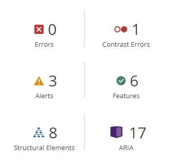

#### 404 page:
* One contrast error showing due to the same h1 as mentioned above.
* One alert to say the text “Click to go to the Homepage” on a link is suspicious text. Amended to “Go to Homepage” 
* One alert stating that link to index page is redundant as adjacent links go to the same url. However the only link that goes to the same url is the small logo at the very top left; I wouldn't say that was adjacent and the button is appropriate. I haven’t made any adjustments to this.

##### Results after changes made: 

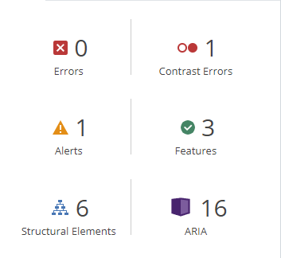

### JSLint
All of my JavaScript for this project has been put through JSLint.
A common warning appears in reference to ‘document’ not being declared throughout JavaScript code. <br>These warnings are unnecessary and I have removed them when using the linter by adding
``` /*jslint browser:true */``` to the top of the page.<br>
Details of the JSLint results for each page can be seen below:

#### Contact-form.js: 
A couple of warnings displayed.
1) Arrow function used within click event it was suggested that a function declaration be used instead, I have amended this.
2) Three lines of code that are over 80 characters long, I have left these in as these are useful descriptive comments.

#### Math.js:
A few warnings displayed.
1. Issue with order of object keys in iconCodesGrouped, corrected as per suggestions.
2. Some trailing spaces, corrected.
3. Expecting object freeze to be used on all exports. I did change this in the file, however this had stopped the website working as intended plus this was not a topic that was covered during the Codeinstitute learning material. I have reverted back to when it was functional before trying to implement object freeze.
4. Arrow functions used within functions it was suggested that a function declaration be used instead, I have updated this.
5. Came up as ```Unexpected 'for' and also ‘let’``` referring to 2x for loops. After doing some online research I have determined that this can be ignored as the for loop is correct.
6. Four lines of code that are over 80 characters long, I have left these in as these are useful descriptive comments.
7. Commas displaying in objects when there isn't a preceding key/value. I have left these in as they were added by the prettier formatter and do not affect functionality.

#### Second-view.js:
Many warnings displayed.
1. Trailing spaces on 4 lines of code, I have removed these.
2. Came up as ```unable to finish ] Expected an identifier and instead saw '}'```. This appears to due to there being a comma after the last import, I have left this in as commas are added by the prettier formatter and do not affect functionality.
3. Thirty lines of code that are over 80 characters long, I have left these in as they are either; useful descriptive comments, strings of text, or HTML code inside of template literals.

#### Slider.js:
One warning displayed.
1. Three lines of code that are over 80 characters long, I have left these in as these are useful descriptive comments.

#### Snippet.js: 
One warning displayed.
1. Relating to jslint’s expectation to use object.freeze on all exports. I do not believe this is a necessary implementation as may affect functionality and it wasn’t suggested in the Codeinstitute learning material  

#### Tooltip.js: 
Couple of warnings displayed.
1. Suggestion to change single quotes to double quotes, amended.
Undeclared ‘bootstrap’. I have ignored this as the code has been taken directly from bootstrap docs and works as intended.

#### Weather-cards.js:
Few warnings displayed.
1. Further reference to commas that have automatically been put in by the prettier formatter. These do not affect functionality.
2. Unexpected trailing space, corrected
3. Further reference to object freeze, ignoring this; reasons as mentioned above. 

#### Weather-data.js
Few warnings displayed.
1. Some trailing spaces in comments, removed
2. Further references to commas that have automatically been put in by the prettier formatter. These do not affect functionality.
3. Fourteen lines of code that are over 80 characters long, I have left these in as they are either; useful descriptive comments, or HTML code inside of template literals.
4. Unexpected let in reference to 2x exported global variables. Not clear why this would be a concern, there is little information about this online and as functionality works as intended for the site. I have not made any adjustments to this.
5. Arrow functions used within functions, it was suggested that a function declaration be used instead, I have amended these.

### Google Lighthouse:
Files sizes of icon and weather cards have been reduced to improve performance.<br>

#### Mobile results
* Homepage Desktop:<br>
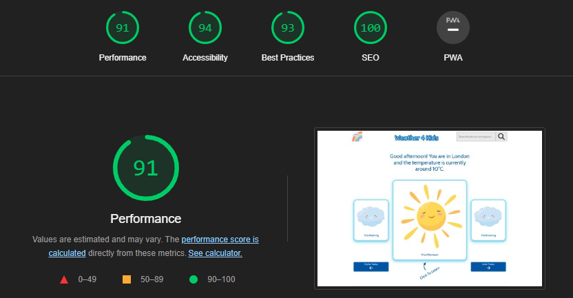
* Homepage Mobile:<br>
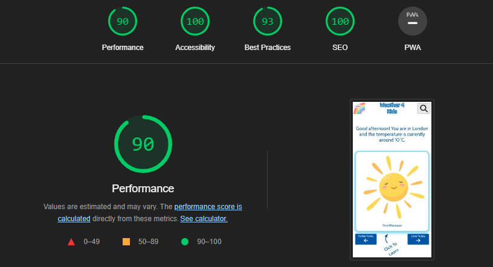
* 404 Page Desktop:<br>
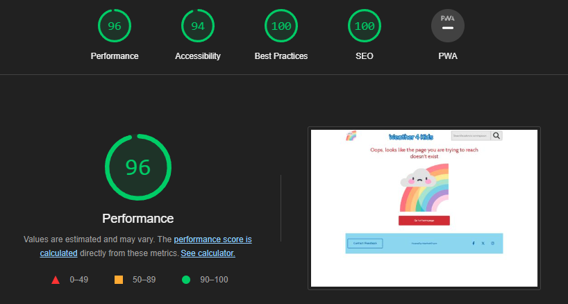
* 404 Page Mobile:<br>
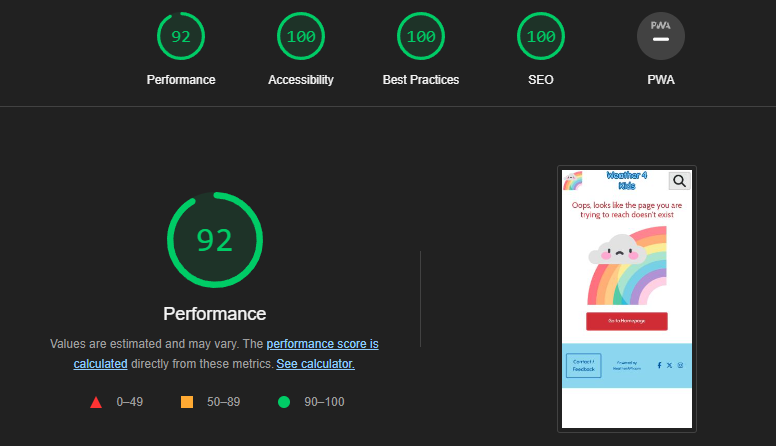

## Manual Testing 
General Responsiveness Test:
* Test: Throughout development and post development I have tested responsiveness by gradually decreasing and increasing the screen heights and widths (down to 320px) to see how the page elements respond. 
* Expected: All elements on the page (header, main content, second view, footer + elements contained within them) adjust as expected and smoothly to different screen sizes and resolutions.
* Result: Pass.

Logo and Site Name Display Test:
* Test: Click on the logo.
* Expected: Redirects/reloads the home page.
* Result: Pass.

Search Bar Visibility Test:
* Test: Reduce screen width to less than 768px to see if the search bar responds.
* Expected: Search icon and bar should be hidden.
* Result: Pass.

Search Icon Tooltip Test:
* Test: Hover/click the search icon to see if there is a response.
* Expected: Tooltip should be displayed indicating ther search function coming soon.
* Result: Pass.

Introductory Message (Location Data) Test:
* Test: Allow location access in browser
* Expected: Displays the appropriate message including user's location and location's current temperature.
* Result: Pass. 

Introductory Message (Default Location Data) Test:
* Test: Allow location access in browser
* Expected: Displays the appropriate message including user's * location and location's current temperature.
* Result: Pass.

Weather Cards Slider Test:
* Test: Click on the earlier today and later today buttons.
* Expected: Weather cards slide left/right accordingly.
* Result: Pass.

Weather Card Click Test:
* Test: Click on a weather card.
* Expected: Switches main content to 'second view'.
* Result: Pass.

Second View - Sound Icon Test:
* Test: Click on the sound icon.
* Expected: Plays appropriate sound (birds chirping, thunder, or rain).
* Result: Pass.

Second View - Learn More Button Test:
* Test: Click on the Learn More button.
* Expected: Updates the snippet box with a new piece of information.
* Result: Pass.

Second View - Return To Homepage Test:
* Test: Click on the go back button or cross icon.
* Expected: Returns to the homepage layout.
* Result:Pass.

Contact/Feedback Button Test:
* Test: Click on the Contact/Feedback button.
* Expected: Replaces main content with the contact/feedback form.
* Result: Pass

Form - Validation Test:
* Test: Submit the form with invalid data.
* Expected: The relevant validation errors should be displayed for the user to see.
* Result: Pass

Form - Submission Test:
* Test: Submit the form with valid data.
* Expected: Submit button should disappear and in its place should be a thank you message with a smiley emoji.
* Result: Pass.

Form - Return To Homepage Test:
* Test: Click on the go back button or cross icon.
* Expected: Returns to the homepage layout.
* Result: Pass. 

404 Page - Redirect To Homepage Test:
* Test: Click on the button to go to the home page.
* Expected: Redirects to the home page.
* Result: Pass.

## Testing User Stories 
As a user, I would like to view the current weather forecast for today in my location.<br>
Result = pass:<br>
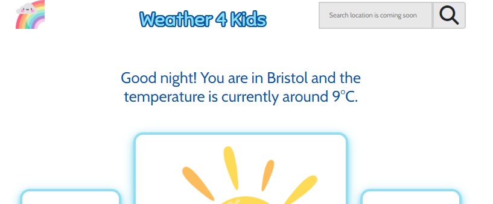

As a user, I would like to view the details of the current weather. Such as precipitation, wind etc.<br>
Result = pass:<br>
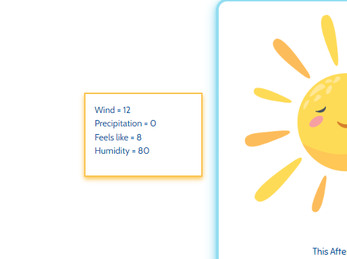


As a user, I would like to see imagery relating to the type of weather.<br>
Result = pass:<br>


As a user, I would like to hear sounds appropriate to the type of weather.<br>
Result = pass (unable to evidence in screenshot):<br>
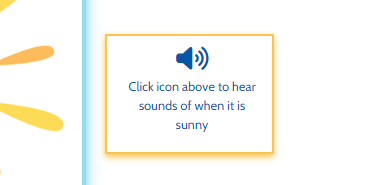

As a user, I would like to interact with elements in the site.<br>
Result = pass:(Highlighted in pink - not all showing on screen)<br>
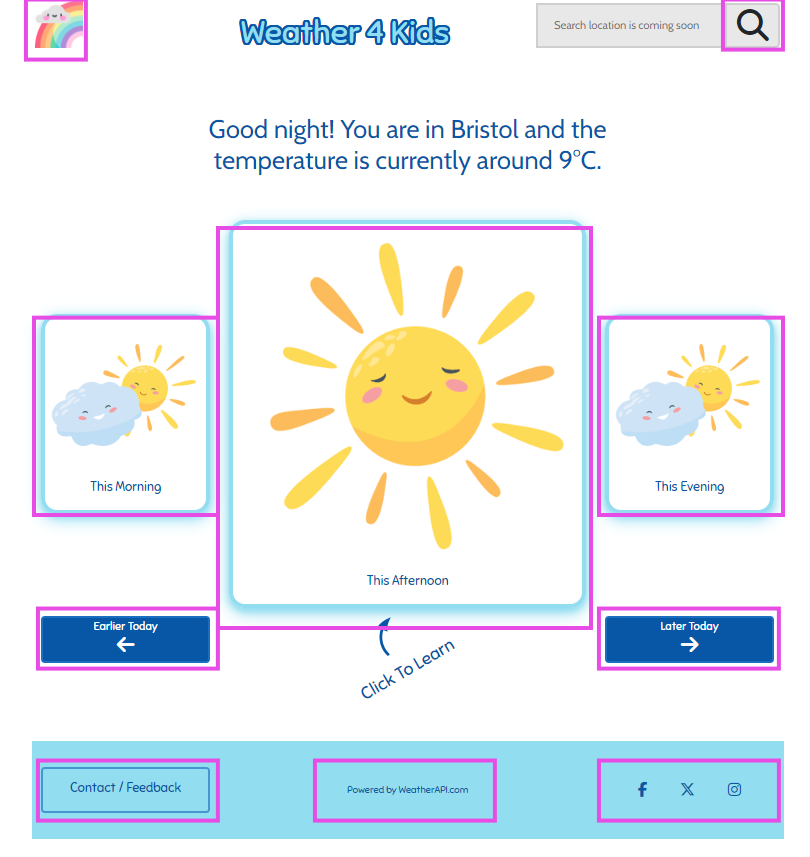

As a user, I would like to learn about weather through snippets of information.<br>
Result = pass:<br>
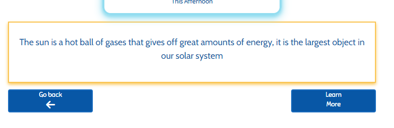

As a user, I would like to provide feedback to the site owner/developer, and for this to be acknowledged.<br>
Result = pass:<br>
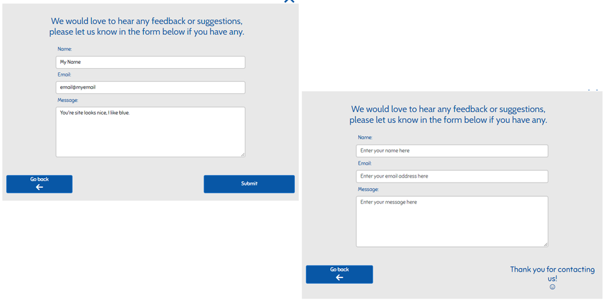

## Other Testing
Google Developer tools:
* I have continuously tested and played around with many different resolutions throughout developement, to ensure there is no unexpected behaviour.

Testing on other browsers:
* Google Chrome.
* Microsoft Edge.
* Firefox.
* Safari (didn't work as intended)

Devices:
* Google Pixel.
* Samsung S10.
* Ipad
* Dell Inspiron (Windows 11).

Other users:
* My friend Aaron Smyth has tested the site on his Apple laptop in the Safari browser (didn't work as intended)
* My partner Laura Gibbons has tested the site herself on different browsers on her Google Pixel.


## Bugs 
Search bar position:
* Bug = Search bar unintentionally moving above the search icon between resolution width 768px-774px.
* Resolution =
I had checked the styles that had been applied in developer tools, however was unable to find any conflicting styles that have resulted in this. Fixed by reducing the text size by 2px.

Display temperature dynamically in introduction message:
  * Bug = message not displaying at all. This was because the value of variable currentPeriodAverages was outside of the required scope. 
  * Resolution = Fixed this by declaring the needed variable in global scope and importing into the other file that it is needed in.

Weatherapi functionality:
* Bug = Was working on localhost but not on github pages.
* Resolution = Fixed by changing fetched urls to https instead of http.

Cross/exit icon position:
* Bug = Unintended position of cross/exit icon in certain widths. 
* Resolution = Fixed this by creating a media query at the appropriate breakpoint that adds a negative margin, this ensures that the icon remains where it is intended.

Earlier today button responsiveness:
* Bug = Unintended height of the button on some small device sizes due to words being pushed onto a new line. 
* Resolution = Fixed this by creating a media query at the appropriate breakpoint that reduces the font size of the today buttons.

Click to learn arrow responsiveness:
* Bug = The arrow becomes miniscule on some small device sizes.
* Resolution = Fixed this by creating a media query at the appropriate breakpoint that reduces the font size of click message; the message is in the came container and was taking up most of the space.

## Unresolved Bugs:
Weather API accuracy:
* Bug = WeatherAPI picks up an inaccurate location on occasion. It will pick a nearby area instead of the actual location. 
* Outcome = I had tried various techniques that I researched online to increase accuracy, owever I was not able to resolve the issue. <br>On further research I have determined that it may in fact be an issue with the actual API itself.

Safari browser compatibility:
* Bug = Despite working as intended on all other browsers, the site is not 100% functional on Safari. The search icon and search bar style is unusual and ‘second view’ is not generated after clicking any of the weather cards. 
* Outcome = Will look to implement working functionality in the future.
